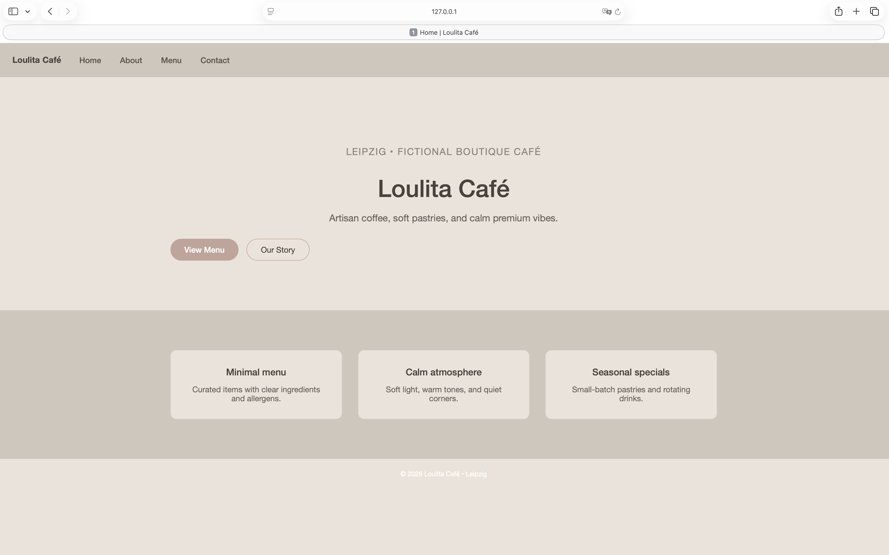
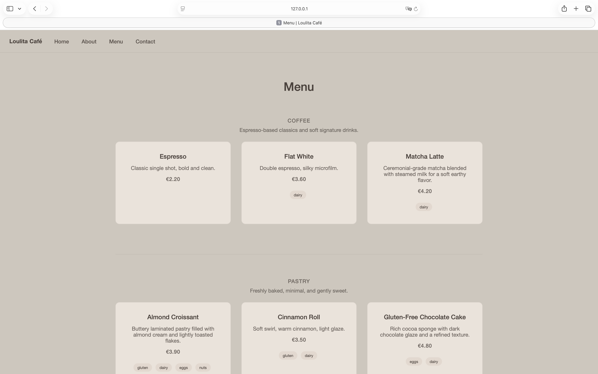

# Loulita Café ☕️

A minimal, elegant Django web application for a boutique café. The project focuses on clean architecture, dynamic content from the database, and a soft premium visual identity suitable for a professional portfolio.

---

## ✨ Features

* **Multipage site**: Home, About, Menu, Contact
* **Dynamic Menu** powered by Django ORM
* **Categories**: Coffee, Pastry, Seasonal
* **Product detail pages** (`/menu/<id>/`)
* **Allergens handling** (stored once, displayed as badges)
* **Admin panel** for managing menu items
* **Reusable templates** with inheritance (`base.html`)
* **Custom CSS** with a soft premium palette
* **Git versioning** with clear commit history

---

## 🧱 Tech Stack

* **Python 3.13**
* **Django 6.0**
* **HTML5 + Django Templates**
* **CSS3 (custom, no frameworks)**
* **SQLite** (development)
* **Git & GitHub**

---

## 📂 Project Structure (simplified)

* `config/` – Project settings and URLs
* `website/` – Main app

  * `models.py` – MenuItem model
  * `views.py` – Page logic (home, menu, detail, etc.)
  * `urls.py` – App routes
  * `templates/` – HTML templates
  * `static/css/style.css` – Custom styles
* `manage.py` – Django management commands

---

## 🗂️ Data Model

**MenuItem** includes:

* `category` (coffee / pastry / seasonal)
* `name`
* `description`
* `ingredients`
* `allergens` (comma-separated, parsed into badges)
* `price`

Menu items are created and edited via the **Django Admin**.

---

## ▶️ Run Locally

1. Clone the repository
2. Create and activate a virtual environment
3. Install dependencies
4. Apply migrations
5. Run the server

Commands:

* `python3 -m venv .venv`
* `source .venv/bin/activate`
* `pip install django`
* `python manage.py migrate`
* `python manage.py runserver`

Open: [http://127.0.0.1:8000/](http://127.0.0.1:8000/)

---

## 🧭 What This Project Demonstrates

* Understanding of **Django fundamentals** (models, views, URLs, templates)
* Ability to build **dynamic features** (menu + detail pages)
* Clean separation of concerns
* Attention to **design, spacing, and UX**
* Professional **Git workflow** with meaningful commits

---

## 📸 Screenshots

---

## 📌 Status

This project is complete as a **portfolio-ready Django application**. Future enhancements could include search, filtering, authentication, or deployment.

---

Made with care by **Alice Kohnen** 💛
